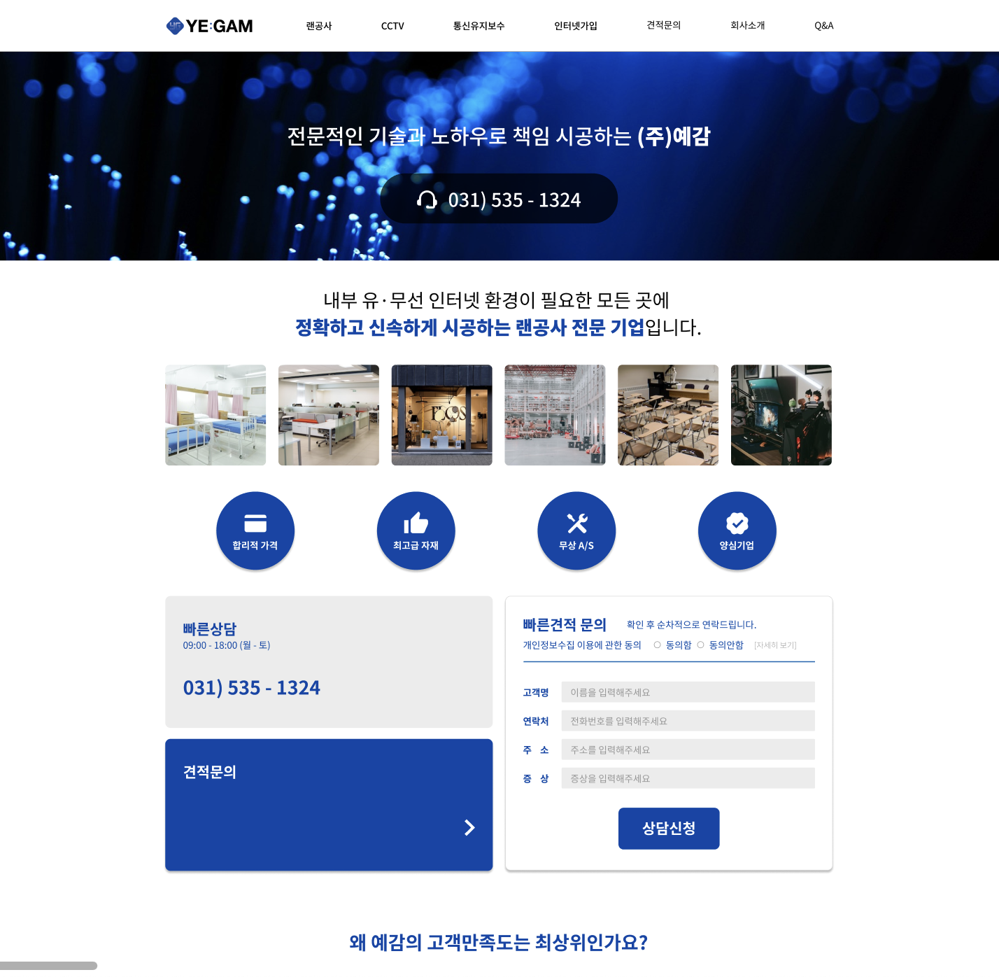

### `1. npm install`

---

### `2. npm start`

`open localhost:3000`

---

### `3. 디렉토리`

---

### `4. 유지보수 Tip` 

#### `회사소개`  
- 주요고객사 로고 추가 및 삭제
    - 디렉토리: pages/comapany/company.json의 client 객체
    - 방법: json객체 데이터를 추가하거나 삭제한다.
        이미지의 경우 comapny.tsx파일의 clientImg에 추가하거나 삭제한다.
- 따뜻한 나눔 수정 및 추가
    - 디렉토리: pages/company/company.json의 share 객체
    - 방법: share에 객체를 추가하거나 수정한다.
        이미지의 경우 company.tsx파일의 shareImg에 추가하거나 수정한다.

#### `자주 묻는 질문`  
- 자주 묻는 질문 수정 및 추가   
    - 디렉토리: pages/qna/qna.json  
    - 방법: json객체로 데이터를 추가하거나 수정한다.

#### `애니메이션 라이브러리`
- AOS를 사용했습니다.
    - 공식문서
        - https://www.npmjs.com/package/aos
    - 초기화 로직 위치 
        - src/index.tsx
    - data-aos로 전체 검색 시 사용된 태그들을 확인할 수 있습니다.